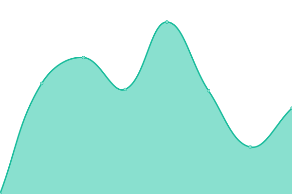
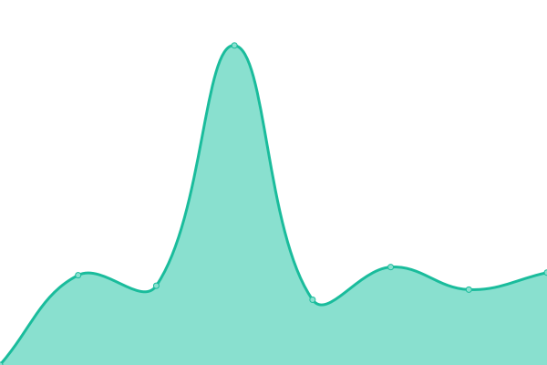
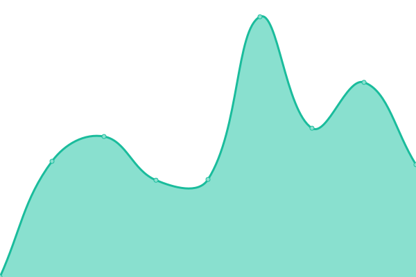

# [📈 Live Status](https://GhostDog98.github.io/upptime): <!--live status--> **🟩 All systems operational**

This repository contains the open-source uptime monitor and status page for [ghostoverflow256](https://GhostDog98.github.io/upptime), powered by [Upptime](https://github.com/upptime/upptime).

<!--start: status pages-->
<!-- This summary is generated by Upptime (https://github.com/upptime/upptime) -->
<!-- Do not edit this manually, your changes will be overwritten -->
<!-- prettier-ignore -->
| URL | Status | History | Response Time | Uptime |
| --- | ------ | ------- | ------------- | ------ |
|  ghostoverflow.gay | 🟩 Up | [ghostoverflow-gay.yml](https://github.com/GhostDog98/upptime/commits/HEAD/history/ghostoverflow-gay.yml) | 

 1828ms
     
 | 

<a href="https://uptime.ghostoverflow.gay/history/ghostoverflow-gay">87.41%</a>
    

|  ai.ghostoverflow.gay | 🟩 Up | [ai-ghostoverflow-gay.yml](https://github.com/GhostDog98/upptime/commits/HEAD/history/ai-ghostoverflow-gay.yml) | 

 673ms
     
 | 

<a href="https://uptime.ghostoverflow.gay/history/ai-ghostoverflow-gay">87.41%</a>
    

|  api.ghostoverflow.gay | 🟩 Up | [api-ghostoverflow-gay.yml](https://github.com/GhostDog98/upptime/commits/HEAD/history/api-ghostoverflow-gay.yml) | 

 1583ms
     
 | 

<a href="https://uptime.ghostoverflow.gay/history/api-ghostoverflow-gay">87.41%</a>
    

|  jellyfin.ghostoverflow.gay | 🟩 Up | [jellyfin-ghostoverflow-gay.yml](https://github.com/GhostDog98/upptime/commits/HEAD/history/jellyfin-ghostoverflow-gay.yml) | 

 1276ms
     
 | 

<a href="https://uptime.ghostoverflow.gay/history/jellyfin-ghostoverflow-gay">87.41%</a>
    

|  lufi.ghostoverflow.gay | 🟩 Up | [lufi-ghostoverflow-gay.yml](https://github.com/GhostDog98/upptime/commits/HEAD/history/lufi-ghostoverflow-gay.yml) | 

 1151ms
     
 | 

<a href="https://uptime.ghostoverflow.gay/history/lufi-ghostoverflow-gay">87.42%</a>
    

|  immich.ghostoverflow.gay | 🟩 Up | [immich-ghostoverflow-gay.yml](https://github.com/GhostDog98/upptime/commits/HEAD/history/immich-ghostoverflow-gay.yml) | 

 1270ms
     
 | 

<a href="https://uptime.ghostoverflow.gay/history/immich-ghostoverflow-gay">87.42%</a>
    

|  [Wikipedia](https://en.wikipedia.org) | 🟩 Up | [wikipedia.yml](https://github.com/GhostDog98/upptime/commits/HEAD/history/wikipedia.yml) | 

 254ms
     
 | 

<a href="https://uptime.ghostoverflow.gay/history/wikipedia">100.00%</a>
    

<!--end: status pages-->

[**Visit our status website →**](https://GhostDog98.github.io/upptime)

## 📄 License

- Powered by: [Upptime](https://github.com/upptime/upptime)
- Code: [MIT](./LICENSE) © [Anand Chowdhary](https://anandchowdhary.com), supported by [Pabio](https://pabio.com)
- Data in the `./history` directory: [Open Database License](https://opendatacommons.org/licenses/odbl/1-0/)
